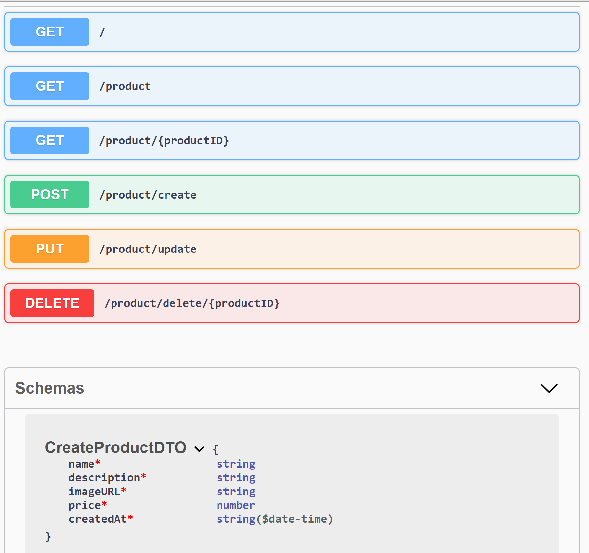

## Description

This app is a example of Nest and Swagger



[Nest](https://github.com/nestjs/nest) framework TypeScript starter repository.

## Installation

```bash
$ npm install
```

## Running the app

```bash
# development
$ npm run start

# watch mode
$ npm run start:dev

# production mode
$ npm run start:prod
```

## Test

```bash
# unit tests
$ npm run test

# e2e tests
$ npm run test:e2e

# test coverage
$ npm run test:cov
```

## Questions and suggestions

- Author - [Giorgio Ventura]
- Twitter - [@gventuraAG](https://twitter.com/gventuraAG)

## License

Nest is [MIT licensed](LICENSE).
